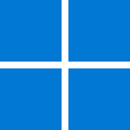

   

  

### 
I'm Hana, a web developer 👩‍💻🚀
  
  

- 🔭Recently I finished 7 months Fullstack course Hack Your Future.
  

- 🌱 I’m currently revising my knowledge with emphasis on NodeJS, React, CSS
  

- ❓ Ask me about anything related to our final graduation project.  
  

- ⚡ Fun fact: I started learning HTML om my own when I was 13 by adapting blog backgrounds, and picked it up last year ☀️

  

   

  

   
   

   

  &nbsp;&nbsp;&nbsp;
    &nbsp;&nbsp;&nbsp;
    &nbsp;&nbsp;&nbsp;
    &nbsp;&nbsp;&nbsp;
    &nbsp;&nbsp;&nbsp;
    &nbsp;&nbsp;&nbsp;
    &nbsp;&nbsp;&nbsp;
    &nbsp;&nbsp;&nbsp;
    &nbsp;&nbsp;&nbsp;
    &nbsp;&nbsp;&nbsp;
    &nbsp;&nbsp;&nbsp;
    &nbsp;&nbsp;&nbsp;
    &nbsp;&nbsp;&nbsp;
    &nbsp;&nbsp;&nbsp;
    &nbsp;&nbsp;&nbsp;
    &nbsp;&nbsp;&nbsp;
    &nbsp;&nbsp;&nbsp;

## Connect with me  

  

  
  

   

  
  
